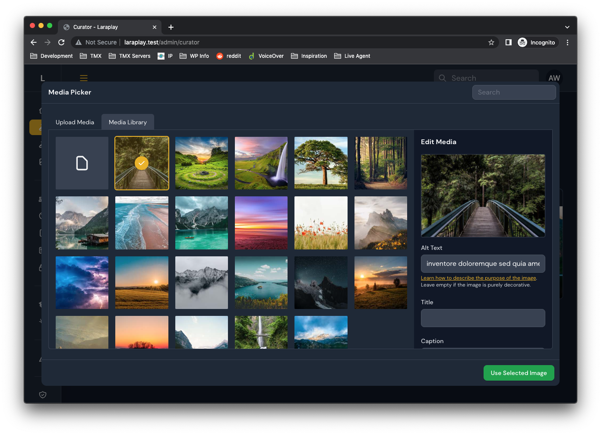
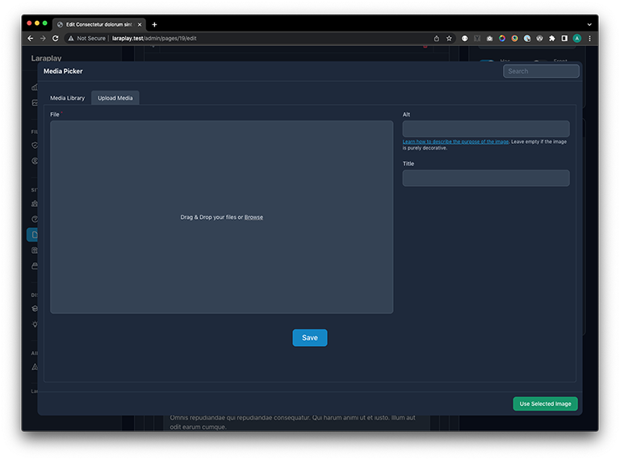

# Filament Curator

A media picker plugin for Filament Admin.

:bangbang: This package is still in development

:bangbang: This package does not work with Spatie Media Library since it requires it's own media model.






## Installation

Install the package via composer.

```bash
composer require awcodes/filament-curator
```

Install Filament Curator into your app. This will publish the necessary migration, model and resources.

```bash
php artisan curator:install
```

## Config

Curator currently has the following options that will be applied to all media uploaded through the media upload form.

- disk: 'public'
- directory: 'trov',
- preserve_file_names: true,
- sizes
  - thumbnail:
    - width: 200
    - height: 200
    - quality: 60
  - medium:
    - width: 640
    - height: null
    - quality: 60
  - large:
    - width: 1024
    - height: null
    - quality: 60

## Usage

Include the MediaPicker button in your forms to trigger the modal and either select an existing image or upload a new one.

```php
use FilamentCurator\Forms\MediaPicker;

MediaPicker::make(string $fieldName)
    ->label(string $customLabel)
```

Media can also be related to models by simply adding the relationship to your model.

```php
use FilamentCurator\Models\Media;

public function ogImage(): HasOne
{
    return $this->hasOne(Media::class, 'id', 'og_image');
}
```

To retrieve different sizes urls, Curator's Media model comes with a helper that takes in a size and returns the url for you. Sizes are based on your config settings.

```php
// Assuming a relationship on a Meta model for ogImage...

$meta->ogImage->size_url('thumbnail');
$meta->ogImage->size_url('medium');
$meta->ogImage->size_url('large');
```

## Versioning

This projects follow the [Semantic Versioning](https://semver.org/) guidelines.

## License

Copyright (c) 2022 Adam Weston and contributors

Licensed under the MIT license, see [LICENSE.md](LICENSE.md) for details.
