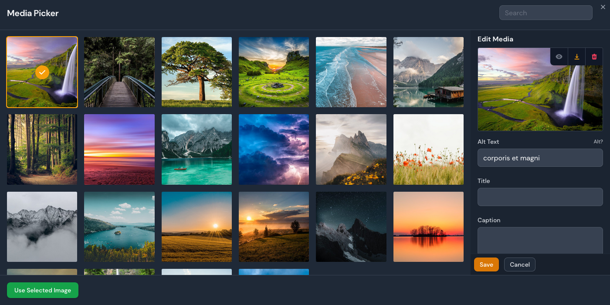
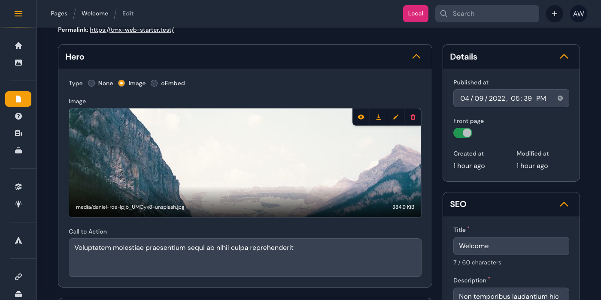

# Filament Curator

[](https://packagist.org/packages/awcodes/filament-curator)
[](https://packagist.org/packages/awcodes/filament-curator)

A media picker/manager plugin for Filament Admin.

> **Warning**
> This package does not work with Spatie Media Library.






## Installation

Install the package via composer.

```bash
composer require awcodes/filament-curator
```

(optional) Publish the config.

```bash
php artisan vendor:publish --tag="filament-curator-config"
```

Install Filament Curator into your app. This will publish the necessary
migration and Filament resources.

```bash
php artisan curator:install
```

## Image Sizes

By default, Curator will generate image sizes for each uploaded image based on
the sizes setting in the config file. If you want to disable image sizes
completely then set the sizes key to an empty array. 

***NOTE: In an effort to keep 
tables performant, Curator will still generate thumbnails even if this 
options is set to an empty array.***

```php
'sizes' => [],
```

### Regenerating Image Sizes

If you need to regenerate all of your image sizes, for instance you add or
remove a size from your config you can do so with the 
`curator:regenerate-thumbnails` command.

```bash
php artisan curator:regenerate-thumbnails --chunk=100
```

## Cloud Providers Table Display

By default, in the Media Resource table the disk icon is set to display a cloud
if the disk is either 'Cloudinary' or 's3'. If you would like to extend or
change this you can do so in the `filament-curator.php` config file.

```php
'cloud_disks' => ['cloudinary', 's3', 'your_cloud_provider'];
```

## Usage

Include the MediaPicker button in your forms to trigger the modal and either
select an existing image or upload a new one. Some of the common methods 
from Filament's `FileUpload` component can be used to help with sizing, 
validation, etc for specific instances of the MediaPicker.

```php
use FilamentCurator\Forms\Components\MediaPicker;

MediaPicker::make(string $fieldName)
    ->label(string $customLabel)
    ->buttonLabel(string | Htmlable | Closure $buttonLabel)
    ->color('primary|secondary|success|danger') // defaults to primary
    ->outlined(true|false) // defaults to true
    ->size('sm|md|lg') // defaults to md
    ->fitContent(true|false) // defaults to false (forces image to fit inside the preview area)
    // see https://filamentphp.com/docs/2.x/forms/fields#file-upload for more information about the following methods
    ->preserveFilenames()
    ->maxWidth()
    ->minSize()
    ->maxSize()
    ->rules()
    ->acceptedFileTypes()
    ->disk()
    ->visibility()
    ->directory()
    ->imageCropAspectRatio()
    ->imageResizeTargetWidth()
    ->imageResizeTargetHeight()
```

Media can also be related to models by simply adding the relationship to your
model.

```php
use FilamentCurator\Models\Media;

public function featuredImage(): HasOne
{
    return $this->hasOne(Media::class, 'id', 'featured_image');
}
```

To retrieve different sizes urls, Curator's Media model comes with a helper that
takes in a size and returns the url for you. Sizes are based on your config
settings.

If a size doesn't exist in your config, then it will return the full size image
url.

```php
// Assuming a relationship on a Post model for featuredImage...

$post->featuredImage->getSizeUrl('thumbnail');
$post->featuredImage->getSizeUrl('medium');
$post->featuredImage->getSizeUrl('large');
```

## Blade Helper

To make it easy to output images without worrying about relationships you
can use the `<x-curator-image/>` blade component. It is recommended to use
the model relation to output your images in the way that is best for your app.

```php
<x-curator-image media-id="2" />
```

## Path Generation
By default, Curator will use the directory and disk set in the config to 
store your media. If you'd like to store the media in a different way 
Curator comes with Path Generators that can be used to modify the behavior. 
Just set the one you want to use in the config.

`DefaultPathGenerator` will save files in disk/directory.

`DatePathGenerator` will save files in disk/directory/Y/m/d.

`UserPathGenerator` will save files in disk/directory/user-auth-identifier

You are also free to use your own Path Generators by implementing the 
`PathGenerator` interface on your own classes.

```php
use FilamentCurator\Config\PathGenerator;

class CustomPathGenerator implements PathGenerator
{
    public function getPath(?string $baseDir = null): string
    {
        return ($baseDir ? $baseDir . '/' : '') . 'my/custom/path';
    }
}
```

Then update the config to use your generator.

```php
'path_generator' => \CustomPathGenerator::class,
```

Path Generators can also be passed into the `directory()` method on the 
`MediaPicker` field.

```php
MediaPicker::make(string $fieldName)
    ->label(string $customLabel)
    ->directory(CustomPathGenerator::class),
```

## Table Display

To show an item in your tables you can use the CuratorColumn. This column
extends Filament's ImageColumn and can use the same methods available on that
column. By default, all image columns will show a generic document image 
unless their mime type is an 'image'.

```php
CuratorColumn::make('relationship_name')
```

## Custom Media Model

If you need additional functionality you can extend Curator's Media model with
your own by updating the 'model' setting in the config file with your own model.

```php
use FilamentCurator\Models\Media as CuratorMedia;

class Media extends CuratorMedia
{
    // ... custom methods and properties
}
```

## Theming

If you are using a custom theme for Filament you will need to add this plugin's
views to your Tailwind CSS config.

```js
content: [
    ...
    "./vendor/awcodes/filament-curator/resources/views/**/*.blade.php",
],
```

## Versioning

This projects follow the [Semantic Versioning](https://semver.org/) guidelines.

## License

Copyright (c) 2022 Adam Weston and contributors

Licensed under the MIT license, see [LICENSE.md](LICENSE.md) for details.
